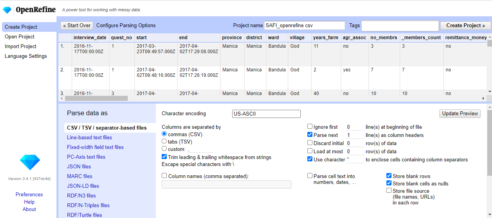
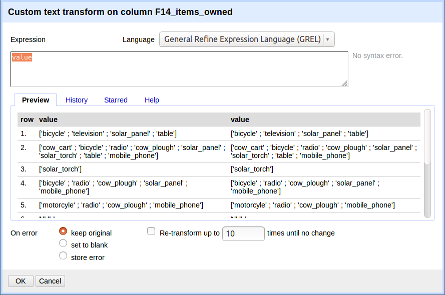

# Lesson

## Creating a new OpenRefine project

Start the program. (Double-click on the openrefine.exe file (or google-refine.exe if using an older version). Java services will start on your machine, and OpenRefine will open in your browser).

OpenRefine can import a variety of file types, including tab separated (`tsv`), comma separated (`csv`), Excel (`xls`, `xlsx`), JSON, XML, RDF as XML, Google Spreadsheets. See the [OpenRefine Importers page](https://github.com/OpenRefine/OpenRefine/wiki/Importers) for more information.

In this first step, we'll browse our computer to the sample data file for this lesson. In this case, we will be using the `Moz_SAFI_Survey_Final_results` CSV file. This data is taken from a farming survey conducted in Mozambique. Peoples names have been changed for anonymisation purposes.

Once OpenRefine is launched in your browser, the left margin has options to `Create Project`, `Open Project`, or `Import Project`. Here we will create a new project:

1. click `Create Project` and select `Get data from` `This Computer`.  
2. Click `Browse...` and select the file `Moz_SAFI_Survey_Final_results.csv`. Click `Open` or double-click on the filename.
3. Click `Next>>` under the browse button to upload the data into OpenRefine.  
4. OpenRefine gives you a preview - a chance to show you it understood the file. If, for example, your file was really tab-delimited, the preview might look strange, you would choose the correct separator in the box shown and click `Update Preview` (bottom left). If this is the wrong file, click `<<Start Over` (upper left).  There are also options to indicate whether the dataset has column headers included and whether OpenRefine should skip a number of rows before reading the data.

5. If all looks well, click `Create Project>>` (upper right). 

Note that at step 1, you could upload data in a standard form from a web address by selecting `Get data from` `Web Addresses (URLs)`. However, this won't work for all URLs.

## Using Facets

*Exploring data by applying multiple filters*

OpenRefine supports faceted browsing as a mechanism for

* seeing a big picture of your data, and
* filtering down to just the subset of rows that you want to change in bulk.

Typically, you create a facet on a particular column. The facet summarizes the cells in that column to give you a big picture of that column, and allows you to filter to some subset of rows for which the cells in that column satisfy some constraint. That's a bit abstract, so let's jump into some examples. 

[More on faceting](https://github.com/OpenRefine/OpenRefine/wiki/Faceting)

Here we will use faceting to look for potential errors in data entry in the `A09_village` column.

1. Scroll over to the `A09_village` column.
2. Click the down arrow and choose `Facet` > `Text facet`.
3. In the left panel, you'll now see a box containing every unique value in the `A09_village` column 
along with a number representing how many times that value occurs in the column.
4. Try sorting this facet by name and by count. Do you notice any problems with the data? What are they?
5. Hover the mouse over one of the names in the `Facet` list. You should see that you have an `edit` function available. 
6. You could use this to fix an error immediately, and OpenRefine will ask whether you want to make the same correction to every value it finds like that one. But OpenRefine offers even better ways to find and fix these errors, which we'll use instead. We'll learn about these when we talk about clustering.

There are two very similar entries for `Ruaca - Nhamuenda` and `Ruaca-Nhamuenda`. You might also wonder if both of these are the same as `Ruaca`. The entry `49` is almost certainly an error but you will not be able to fix it by reference to other data.

> ## Exercise
>
> 1. Using faceting, find out how many different A01_interview_date values there are in the survey results.  
>
> 2. Use faceting to produce a timeline display for A01_interview_date
>
> 3. Is the column formatted as Text or Date? How does changing the format change the faceting display?
> 
> > ## Solution
> > 
> > 1. For the column `A01_interview_date` do `Facet` > `Text facet`. A box will appear in the left panel showing that there are 19 unique entries in
> > this column.  
> > 2. By default, the column `A01_interview_date` is formatted as Text. You can change the format by doing `Edit cells` > `Common transforms` > 
> > `To date`.  Notice the the values in the column turn green. Doing `Facet` > `Timeline facet` creates a box in the left panel that shows a histogram of the number of entries for each date.    
> > 3. In the text based facet, hovering over an entry gives an option to `include`. This will filter the data set to include only those selected. In the Timeline facet, there are `grab bars` initially at each end of the display which can be dragged with the mouse to filter the records.
> > 4. Make sure that the format of the column is correctly set before you try to filter using the facet.
> > 
> {: .solution}
{: .challenge}

## Using clustering to detect possible typing errors

In OpenRefine, clustering means "finding groups of different values that might be alternative representations of the same thing". For example, the two strings `New York` and `new york` are very likely to refer to the same concept and just have capitalization differences. Likewise, `Gödel` and `Godel` probably refer to the same person. Clustering is a very powerful tool for cleaning datasets which contain misspelled or mistyped entries. OpenRefine has several clustering algorithms built in. Experiment with them, and learn more about these algorithms and how they work. 

1. In the `A09_village` Text Facet we created in the step above, click the `Cluster` button.
2. In the resulting pop-up window, you can change the `Method` and the `Keying Function`. Try different combinations to 
 see what different mergers of values are suggested.
3. Select the `key collision` method and `ngram-fingerprint` keying function. It should identify one cluster. 
4. Click the `Merge?` box beside the cluster, then click `Merge Selected and Recluster` to apply the corrections to the dataset.
4. Try selecting different `Methods` and `Keying Functions` again, to see what new merges are suggested. You should find no more clusters are found. None of the available methods offered to cluster `Ruaca-Nhamuenda` with `Ruaca`  If we wanted to merge these we could hover over one or the other and select edit and manually change one of the names.

Important: If you `Merge` using a different method or keying function, or more times than described in the instructions above, 
your solutions for later exercises will not be the same as shown in those exercise solutions.

## Different clustering algorithms 

The technical details of how the different clustering algorithm work can be found at the link below.

[More on clustering](https://github.com/OpenRefine/OpenRefine/wiki/Clustering-In-Depth)

## Transforming data

The data in the `F14_items_owned` column is a set of items in a list. The list is in square brackets and each item is in single quotes. Before we split the list into individual items in the next section, we first want to remove the brackets and the quotes.

1. Click the down arrow at the top of the `F14_items_owned` column. Choose `Edit Cells` > `Transform...`
2. This will open up a window into which you can type a GREL expression. GREL stands for Google Refine Expression Language.

3. In the Expression box type `value.replace("['","").replace("'","").replace("]","")` and click `OK`
4. What the expression means is this: Take the `value` in each cell in the selected column, replace all of the "[" with "" (i.e. nothing - delete), then do the same for all of the "'" (single quotes and then the same for "]". The result is a simple ";" delimited list.

## Splitting a column into multiple columns

If data in a column needs to be split into multiple columns, and the parts are separated by a common separator (say a semi-colon, or a space), you can use that separator to divide up the pieces into their own columns.

1. Let us suppose we want to split the modified `F14_items_owned` column into separate columns for each item in the list. 
2. Click the down arrow at the top of the `F14_items_owned` column. Choose `Edit Column` > `Split into several columns...`
3. In the pop-up, in the `Separator` box, replace the comma with a semi-colon.
4. Uncheck the box that says `Remove this column`.
5. Click `OK`. You'll get some new columns called `F14_items_owned 1`, `F14_items_owned 2`, and so on.

> ## Exercise
>
> The `F10_liv_owned` column also contains a list of Livestock in the same format as `F14_items_owned`. 
> Remove the brackets and quotes as before and split the list into seperate items
Try to change the name of the second new column to "species". How can you correct the problem you encounter?
> 
> > ## Solution
> > 
> > Click the down arrow at the top of the `F10_liv_owned` column. Choose `Edit Cells` > `Transform...`
> > Click on the History tab and the `Reuse` link against the expression that we created earlier. The expression will be copied into the expression text box.
> > Go back to the preview tab to see the what the changes will lok like.
> > Click `OK`
> > 
> >
> {: .solution}
{: .challenge}

## Undo / Redo

It's common while exploring and cleaning a dataset to discover after you've made a change that you really should have done something else first. OpenRefine provides `Undo` and `Redo` operations to make this easy.

1. Click where it says `Undo / Redo` on the left side of the screen. All the changes you have made so far are listed here.
2. Click on the step that you want to go back to, in this case the previous step. The added columns will disappear.
3. Notice that you can still click on the last step and make the columns reappear, and toggle back and forth between these states.
4. Leave the dataset in the state in which the `scientificNames` were clustered, but not yet split.

Important: If you skip this step, your solutions for later exercises will not be the same as shown in those exercise solutions.

## Trim Leading and Trailing Whitespace

Words with spaces at the beginning or end are particularly hard for we humans to tell from strings without, but the blank characters will make a difference to the computer. We usually want to remove these. OpenRefine provides a tool to remove blank characters from the beginning and end of any entries that have them.

1. In the header for the column `scientificName`, choose `Edit cells` > `Common transforms` > `Trim leading and trailing whitespace`.
2. Notice that the `Split` step has now disappeared from the `Undo / Redo` pane on the left and is replaced with a `Text transform on 3 cells`
3. Perform the same `Split` operation on `scientificName` that you undid earlier. This time you should only get two new columns. Why?

> ## Solution
> 
> Removing the leading white spaces means that each entry in this column has exactly one space (between the genus and species names). 
> Therefore, when you split with space as the separator, you will get only two columns.
{: .solution}

Important: `Undo` the splitting step before moving on to the next lesson. If you skip this step, your solutions 
for later exercises will not be the same as shown in those exercise solutions.

## Using undo and redo.

## Removing white space

