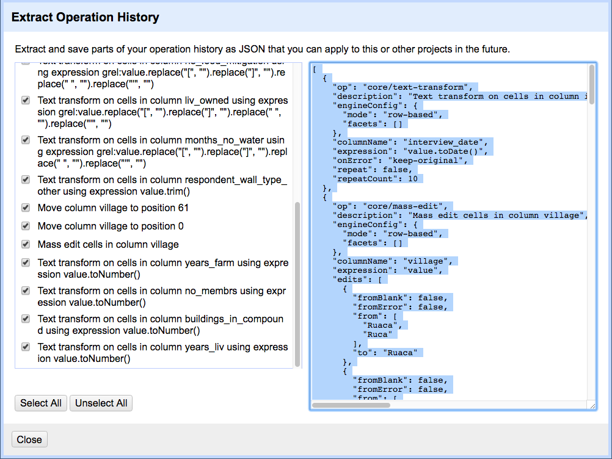

# Lesson

## How OpenRefine records what you have done

As you conduct your data cleaning and preliminary analysis, OpenRefine saves every change you make to the dataset. These
changes are saved in a format known as JSON (JavaScript Object Notation). You can export this JSON script and apply it to other data files. If you had 20 files to clean, and they all had the same type of errors (e.g. misspellings, leading white spaces), and all
files had the same column names, you could save the JSON script, open a new file to clean in OpenRefine, paste in the script and run it.
This gives you a quick way to clean all of your related data.

## Saving your work as a script

1. In the `Undo / Redo` section, click `Extract...`, and select the steps that you want to apply to other datasets by clicking the check boxes.

2. Copy the code from the right hand panel and paste it into a text editor (like NotePad on Windows or TextEdit on Mac). Make sure it saves as a plain text file. In TextEdit, do this by selecting `Format` > `Make plain text` and save the file as a `.txt` file.

## Importing a script to use against another dataset

Let's practice running these steps on a new dataset. We'll test this on an uncleaned version of the dataset we've been working with.

1. Start a new project in OpenRefine using the messy dataset you downloaded before. Give the project a new name.  
2. Click the `Undo / Redo` tab > `Apply` and paste in the contents of `.txt` file with the JSON code.
3. Click `Perform operations`. The dataset should now be the same as your other cleaned dataset.

For convenience, we used the same dataset. In reality you could use this process to clean related datasets. For example, data that you had collected over different fieldwork periods or data that was collected by different researchers (provided everyone uses the same column headings). The data in this file was generated from an eSurvey system with the actual survey being delivered centrally to a smartphone, so the column headings are pretty much guaranteed to be the same.


