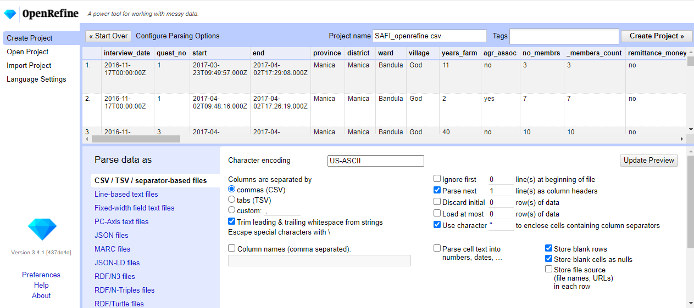

::::::::::::::::::::::::::::::::::::::: objectives

- Create a new OpenRefine project from a CSV file.
- Understand potential problems with file headers.
- Use facets to summarize data from a column.
- Use clustering to detect possible typing errors.
- Understand that there are different clustering algorithms which might give different results.
- Employ drop-downs to remove white spaces from cells.
- Manipulate data using previous steps with undo/redo.

::::::::::::::::::::::::::::::::::::::::::::::::::

:::::::::::::::::::::::::::::::::::::::: questions

- How can we bring our data into OpenRefine?
- How can we sort and summarize our data?
- How can we find and correct errors in our raw data?

::::::::::::::::::::::::::::::::::::::::::::::::::

## Creating a new OpenRefine project

If you have not started OpenRefine yet, follow the [Setup](../learners/setup.md)
instructions before continuing.

OpenRefine can import a variety of file types, including tab separated (`tsv`),
comma separated (`csv`), Excel (`xls`, `xlsx`), JSON, XML, RDF as XML, and
Google Spreadsheets. See the [OpenRefine Create a Project by Importing Data
page](https://docs.openrefine.org/manual/starting/#create-a-project-by-importing-data)
for more information.

In this first step, we'll browse our computer to the sample data file for this
lesson.
In this case, we will be using data obtained from interviews of farmers in two
countries in eastern sub-Saharan Africa (Mozambique and Tanzania).
If you haven't yet downloaded the data, see the [instructions on downloading
the data in Setup](../learners/setup.md).

::: instructor

### Importing the sample data

The file has a single header row and has comma-separated values.
OpenRefine should not have trouble figuring out the settings for parsing these
data. Either US-ASCII or UTF-8 are fine as character encoding.

Consider giving the project a meaningful name. If you do, briefly explain how
that name is meaningful (to you and hopefully others).

There are many columns in the file, which may be handled after importing.

::::::::::::::

::: instructor

### Open Project when you returned to start screen

If at any time during the lesson you (accidentally) end up back at the start screen,
you could demonstrate "Open Project".
It opens your project where you were, which demonstrates that OpenRefine
continually saves the project in the background.

::::::::::::::

Once OpenRefine is launched in your browser, the left margin has options to
`Create Project`, `Open Project`, or `Import Project`. Here we will create a
new project:

1. Click `Create Project` and select `Get data from` `This Computer`.

2. Click `Choose Files` and select the file `SAFI_openrefine.csv` that you
  downloaded in the [setup step](../learners/setup.md). Click
  `Open` or double-click on the filename.

3. Click `Next>>` under the browse button to upload the data into OpenRefine.

4. OpenRefine gives you a preview - a chance to show you it understood the
  file. If, for example, your file was really tab-delimited, the preview might
  look strange. You would then choose the correct separator in the box shown
  and click `Update Preview` (middle right). If this is the wrong file, click
  `<<Start Over` (upper left).  There are also options to indicate whether the
  dataset has column headers included and whether OpenRefine should skip a
  number of rows before reading the data.
  {alt='Parse Options'}

5. If all looks well, click `Create Project>>` (upper right).

Note that at step 1, you could upload data in a standard form from a web
address by selecting `Get data from` `Web Addresses (URLs)`.
The URLs must point to data in a file type that OpenRefine understands, just
like the types that you could upload.
Instead of downloading the dataset file as you did during
[setup](../learners/setup.md) and uploading it from your computer,
you could have submitted its URL here.
Fully understanding this functionality is out of scope for this lesson.
The [OpenRefine manual's section on importing from Web addresses
(URLs)](https://docs.openrefine.org/manual/starting#web-addresses-urls) provides
further information.

## Using Facets

*Exploring data by applying multiple filters*

Facets are one of the most useful features of OpenRefine and can help both get
an overview of the data in a project as well as help you bring more consistency
to the data. OpenRefine supports faceted browsing as a mechanism for

- seeing a big picture of your data, and
- filtering down to just the subset of rows that you want to change in bulk.

A 'Facet' groups all the like values that appear in a column, and then allows
you to filter the data by these values and edit values across many records at
the same time.

One type of Facet is called a 'Text facet'. This groups all the identical text
values in a column and lists each value with the number of records it appears
in. The facet information always appears in the left hand panel in the
OpenRefine interface.

Here we will use faceting to look for potential errors in data entry in the `village` column.

1. Scroll over to the `village` column.
2. Click the down arrow and choose `Facet` > `Text facet`.
3. In the left panel, you'll now see a box containing every unique value in the
  `village` column along with a number representing how many times that value
  occurs in the column.
4. Try sorting this facet by name and by count. Do you notice any problems with
  the data? What are they?
5. Hover the mouse over one of the names in the `Facet` list. You should see
  that you have an `edit` function available.
6. You could use this to fix an error immediately, and OpenRefine will ask
  whether you want to make the same correction to every value it finds like
  that one. But OpenRefine offers even better ways to find and fix these
  errors, which we'll use instead. We'll learn about these when we talk about
  clustering.

:::::::::::::::  solution

## Solution

- `Chirdozo` is likely a mis-entry of `Chirodzo`.
- `Ruca` is likely a mis-entry of `Ruaca`.
- `Ruaca - Nhamuenda` and `Ruaca-Nhamuenda` refer to the same place (differ
  only by spaces around the hyphen). You might also wonder if both of these
  are the same as `Ruaca`. We will see how to correct these misspelled and
  mistyped entries in a later exercise.
- The entry `49` is almost certainly an error but you will not be able to fix
  it by reference to other data.
  

:::::::::::::::::::::::::

:::::::::::::::::::::::::::::::::::::::  challenge

## Exercise

1. Using faceting, find out how many different `interview_date` values there
  are in the survey results.

2. Is the column formatted as Text or Date?

3. Use faceting to produce a timeline display for `interview_date`. You will
  need to use `Edit cells` > `Common transforms` > `To date` to convert this
  column to dates.

4. During what period were most of the interviews collected?

:::::::::::::::  solution

## Solution

For the column `interview_date` do `Facet` > `Text facet`. A box will
appear in the left panel showing that there are 19 unique entries in
this column.
By default, the column `interview_date` is formatted as Text. You can
change the format by doing `Edit cells` > `Common transforms` > `To date`.

Notice the the values in the column turn green. Doing `Facet` > `Timeline facet` creates a box in the left panel that shows a histogram of the number
of entries for each date.

Most of the data was collected in November of 2016.

:::::::::::::::::::::::::

::::::::::::::::::::::::::::::::::::::::::::::::::

:::::::::::::::::::::::::::::::::::::::::  callout

## Other types of Facets

Please see the
[OpenRefine Manual section on Facets](https://openrefine.org/docs/manual/facets)
for reference information on all types of facets.

Besides 'Text facets' OpenRefine also supports several other types of
facet. These include:

- Numeric facets
- Timeline facets (for dates)
- Custom facets
- Scatterplot facets

**Numeric and Scatterplot facets** display graphs instead of lists of values.
The numeric facet graph includes 'drag and drop' controls you can use to set
a start and end range to filter the data displayed.
A scatterplot facet allows you to visualise values in a pair of numeric columns
as a scatterplot, so that you can filter by two-value combinations.

::: instructor

### Exercises available in OpenRefine for Ecologists lesson

These facet types are explored further in [Examining Numeric Columns in the
*OpenRefine for Ecologists* lesson][ecology-facets].
Note that this is a different lesson!

[ecology-facets]: https://datacarpentry.org/OpenRefine-ecology-lesson/03-exploring-data.html#exploring-numeric-columns

::::::::::::::

**Custom facets** are a range of different types of facets. Some of the
default custom facets are:

- Word facet - this breaks down text into words and counts the number of
  records each word appears in
- Duplicates facet - this results in a binary facet of 'true' or 'false'.
  Rows appear in the 'true' facet if the value in the selected column is an
  exact match for a value in the same column in another row
- Text length facet - creates a numeric facet based on the length (number of
  characters) of the text in each row for the selected column. This can be
  useful for spotting incorrect or unusual data in a field where specific
  lengths are expected (e.g. if the values are expected to be years, any row
  with a text length more than 4 for that column is likely to be incorrect)
- Facet by blank - a binary facet of 'true' or 'false'. Rows appear in the
  'true' facet if they have no data present in that column. This is useful
  when looking for rows missing key data.

::::::::::::::::::::::::::::::::::::::::::::::::::

## Using clustering to detect possible typing errors

In OpenRefine, clustering means "finding groups of different values that might
be alternative representations of the same thing". For example, the two strings
`New York` and `new york` are very likely to refer to the same concept and just
have capitalization differences. Likewise, `Gödel` and `Godel` probably refer
to the same person. Clustering is a very powerful tool for cleaning datasets
which contain misspelled or mistyped entries. OpenRefine has several clustering
algorithms built in. Experiment with them, and learn more about these
algorithms and how they work.

1. In the `village` Text Facet we created in the step above, click the `Cluster` button.
2. In the resulting pop-up window, you can change the `Method` and the `Keying Function`. Try different combinations to see what different mergers of values are suggested.
3. Select the `key collision` method and `metaphone3` keying function. It
  should identify two clusters.
4. Click the `Merge?` box beside each cluster, then click `Merge Selected and Recluster` to apply the corrections to the dataset.
5. Try selecting different `Methods` and `Keying Functions` again, to see what
  new merges are suggested.
6. You should find that using the default settings, no more clusters are found,
  for example to merge `Ruaca-Nhamuenda` with `Ruaca` or `Chirdozo` with
  `Chirodzo`. (Note that the `nearest neighbor` method with `ppm` distance,
  `radius` ≥ 4, and `block chars` ≤ 4 will find these clusters, as well
  as other settings with `levenshtein` distance)
7. To merge these values we will hover over them in the village text facet,
  select edit, and manually change the names. Change `Chirdozo` to `Chirodzo`
  and `Ruaca-Nhamuenda` to `Ruaca`. You should now have four clusters:
  `Chirodzo`, `God`, `Ruaca` and `49`.

Important: If you `Merge` using a different method or keying function, or more
times than described in the instructions above, your solutions for later
exercises will not be the same as shown in those exercise solutions.

The [manual's section on clustering][clustering] provides technical details on
how the different clustering algorithms work.

[clustering]: https://openrefine.org/docs/technical-reference/clustering-in-depth

## Transforming data

The data in the `items_owned` column is a set of items in a list. The list is
in square brackets and each item is in single quotes. Before we split the list
into individual items in the next section, we first want to remove the brackets
and the quotes.

1. Click the down arrow at the top of the `items_owned` column. Choose
  `Edit Cells` > `Transform...`

2. This will open up a window into which you can type a GREL expression. GREL
  stands for General Refine Expression Language.
  {alt='OR\_Transform'}

3. First we will remove all of the left square brackets (`[`). In the
  Expression box type `value.replace("[", "")` and click `OK`.

4. What the expression means is this: Take the `value` in each cell in the
  selected column and replace all of the "[" with "" (i.e. nothing - delete).

5. Click `OK`. You should see in the `items_owned` column that there are no
  longer any left square brackets.

:::::::::::::::::::::::::::::::::::::::  challenge

## Exercise

Use this same strategy to remove the single quote marks (`'`), the
right square brackets (`]`), and spaces from the `items_owned` column.

:::::::::::::::  solution

## Solution

1. `value.replace("'", "")`
2. `value.replace("]", "")`
3. `value.replace(" ", "")`
  You should now have a list of items separated by semi-colons (`;`).

:::::::::::::::::::::::::

::::::::::::::::::::::::::::::::::::::::::::::::::

Now that we have cleaned out extraneous characters from our `items_owned`
column, we can use a text facet to see which items were commonly owned or
rarely owned by the interview respondents.

1. Click the down arrow at the top of the `items_owned` column. Choose
  `Facet` > `Custom text facet...`
2. In the `Expression` box, type `value.split(";")`.
3. Click `OK`.

You should now see a new text facet box in the left-hand pane.

:::::::::::::::::::::::::::::::::::::::  challenge

## Exercise

Which two items are the most commonly owned? Which are the two
least commonly owned?

:::::::::::::::  solution

## Solution

Select `Sort by:` `count`. The most commonly owned items are
mobile phone and radio, the least commonly owned are cars and computers.

:::::::::::::::::::::::::

::::::::::::::::::::::::::::::::::::::::::::::::::

:::::::::::::::::::::::::::::::::::::::  challenge

## Exercise

Perform the same clean up steps and customized text faceting for
the `months_lack_food` column. Which month(s) were farmers
more likely to lack food?

:::::::::::::::  solution

## Solution

All four cleaning steps can be performed by combining `.replace`
statements. The command is:
`value.replace("[", "").replace("]", "").replace(" ", "").replace("'", "")`
This can also be done in four separate steps if preferred.
November was the most common month for respondents to lack food.

:::::::::::::::::::::::::

::::::::::::::::::::::::::::::::::::::::::::::::::

:::::::::::::::::::::::::::::::::::::::  challenge

## Exercise

Perform the same clean up steps for the `months_no_water`, `liv_owned`,
`res_change`, and `no_food_mitigation` columns.
Hint: To reuse a GREL command, click the `History` tab and then
click `Reuse` next to the command you would like to apply to that
column.

::::::::::::::::::::::::::::::::::::::::::::::::::

## Using undo and redo

It's common while exploring and cleaning a dataset to discover after you've
made a change that you really should have done something else first. OpenRefine
provides `Undo` and `Redo` operations to make this easy.

:::::::::::::::::::::::::::::::::::::::  challenge

## Exercise

1. Click where it says `Undo / Redo` on the left side of the screen. All the
  changes you have made so far are listed here.
2. Click on the step that you want to go back to, in this case go back
  several steps to before you had done any text transformation.
3. Visually confirm that those columns now contain the special characters
  that we had removed previously.
4. Notice that you can still click on the later steps to `Redo` the actions.
  Before moving on to the next lesson, redo all the steps in your analysis
  so that all of the columns you modified are lacking in square brackets,
  spaces, and single quotes.
  

::::::::::::::::::::::::::::::::::::::::::::::::::

## Trim Leading and Trailing Whitespace

Sometimes spaces (or tabs, or newline characters) will be present at the beginning
or end of a text cell.
They may have been in the dataset that was imported, or appear when you perform
operations on the data, such as splitting text.
While we as humans cannot always see or notice these (especially if they are at
the end of a word), a computer always sees them.
These spaces are often unwanted variations that should to be removed.

As of version 3.4, OpenRefine provides the option to trim (i.e. remove) leading and
trailing whitespace during the import of data (see image at the top of this page).
This is then applied to the data in all columns.

OpenRefine also provides a menu option to remove blank
characters from the beginning and end of any entries in the column that you choose.

1. Edit the `village` on the first row to introduce a space at the end, set to `God `.
2. Create a new text facet for the `village` column. You should now see two
  different entries for `God`, one of which has a trailing whitespace.
3. To remove the whitespace, choose `Edit cells` > `Common transforms` >
  `Trim leading and trailing whitespace`.
4. You should now see only four choices in your text facet again.

:::::::::::::::::::::::::::::::::::::::: keypoints

- OpenRefine can import a variety of file types.
- OpenRefine can be used to explore data using filters.
- Clustering in OpenRefine can help to identify different values that might mean the same thing.
- OpenRefine can transform the values of a column.

::::::::::::::::::::::::::::::::::::::::::::::::::

