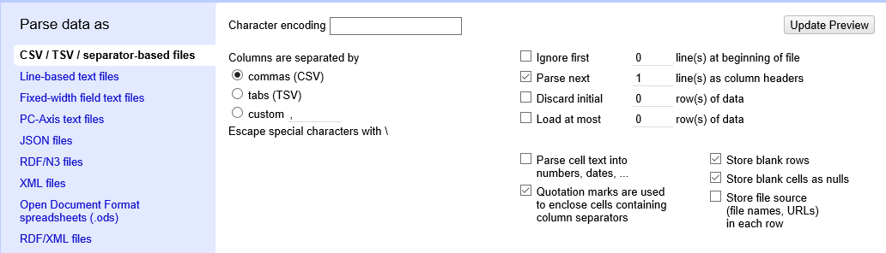
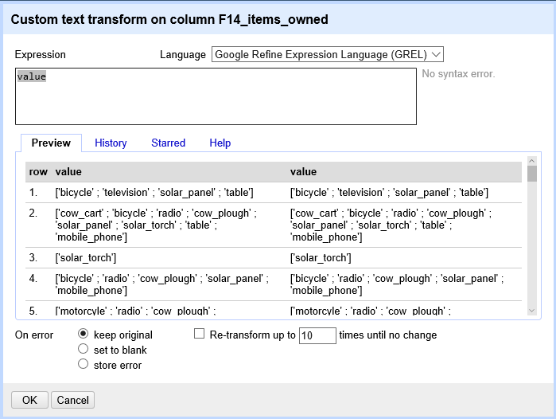

# Lesson

## Creating a new OpenRefine project

In Windows, you can start the OpenRefine program by double-clicking on the openrefine.exe file. Java services will start automatically on your machine, and OpenRefine will open in your browser. On a Mac, OpenRefine can be launched from your Applications folder. If you are using Linux, you will need to navigate to your OpenRefine directory in the command line and run `./refine`.

OpenRefine can import a variety of file types, including tab separated (`tsv`), comma separated (`csv`), Excel (`xls`, `xlsx`), JSON, XML, RDF as XML, Google Spreadsheets. See the [OpenRefine Importers page](https://github.com/OpenRefine/OpenRefine/wiki/Importers) for more information.

In this first step, we'll browse our computer to the sample data file for this lesson.
In this case, we will be using data obtained from interviews of farmers in two countries in eastern sub-Saharan Africa (Mozambique and Tanzania).
Instructions on downloading the data are available
[here]({{site.baseurl}}/setup.html).

Once OpenRefine is launched in your browser, the left margin has options to `Create Project`, `Open Project`, or `Import Project`. Here we will create a new project:

1\. Click `Create Project` and select `Get data from` `This Computer`.
2\. Click `Choose Files` and select the file `SAFI_messy_openrefine.csv`. Click `Open` or double-click on the filename.
3\. Click `Next>>` under the browse button to upload the data into OpenRefine.
4\. OpenRefine gives you a preview - a chance to show you it understood the file. If, for example, your file was really tab-delimited, the preview might look strange, you would choose the correct separator in the box shown and click `Update Preview` (bottom left). If this is the wrong file, click `<<Start Over` (upper left).  There are also options to indicate whether the dataset has column headers included and whether OpenRefine should skip a number of rows before reading the data.

5\. If all looks well, click `Create Project>>` (upper right).

Note that at step 1, you could upload data in a standard form from a web address by selecting `Get data from` `Web Addresses (URLs)`. However, this won't work for all URLs.

## Using Facets

*Exploring data by applying multiple filters*

Facets are one of the most useful features of OpenRefine and can help both get an overview of the data in a project as well as helping you bring more consistency to the data. OpenRefine supports faceted browsing as a mechanism for

* seeing a big picture of your data, and
* filtering down to just the subset of rows that you want to change in bulk.

A 'Facet' groups all the like values that appear in a column, and then allow you to filter the data by these values and edit values across many records at the same time.

One type of Facet is called a 'Text facet'. This groups all the identical text values in a column and lists each value with the number of records it appears in. The facet information always appears in the left hand panel in the OpenRefine interface.

Here we will use faceting to look for potential errors in data entry in the `village` column.

1. Scroll over to the `village` column.
2. Click the down arrow and choose `Facet` > `Text facet`.
3. In the left panel, you'll now see a box containing every unique value in the `village` column
along with a number representing how many times that value occurs in the column.
4. Try sorting this facet by name and by count. Do you notice any problems with the data? What are they?
5. Hover the mouse over one of the names in the `Facet` list. You should see that you have an `edit` function available.
6. You could use this to fix an error immediately, and OpenRefine will ask whether you want to make the same correction to every value it finds like that one. But OpenRefine offers even better ways to find and fix these errors, which we'll use instead. We'll learn about these when we talk about clustering.

> ## Solution
> - `Chirdozo` is likely a mis-entry of `Chirodzo`.
> - `Ruca` is likely a mis-entry of `Ruaca`.
> - `Ruaca - Nhamuenda` and `Ruaca-Nhamuenda` refer to the same place (differ only by spaces around the hyphen). You might also wonder if both of these are the same as `Ruaca`. We will see how to correct these misspelled and mistyped entries in a later exercise.
> - The entry `49` is almost certainly an error but you will not be able to fix it by reference to other data.
{: .solution}

> ## Exercise
>
> 1. Using faceting, find out how many different `interview_date` values there are in the survey results.
>
> 2. Is the column formatted as Text or Date?
>
> 3. Use faceting to produce a timeline display for `interview_date`. You will need to use `Edit cells` > `Common transforms` > `To date` to convert this column to dates.
>
> 4. During what period were most of the interviews collected?
>
> > ## Solution
> >
> > For the column `interview_date` do `Facet` > `Text facet`. A box will appear in the left panel showing that there are 19 unique entries in
> > this column.
> > By default, the column `interview_date` is formatted as Text. You can change the format by doing `Edit cells` > `Common transforms` >
> > `To date`.  Notice the the values in the column turn green. Doing `Facet` > `Timeline facet` creates a box in the left panel that shows a histogram of the number of entries for each date.
> >
> > Most of the data was collected in November of 2016.
> {: .solution}
{: .challenge}

> ## More on Facets
> [OpenRefine Wiki: Faceting](https://github.com/OpenRefine/OpenRefine/wiki/Faceting)
>
> As well as 'Text facets' Refine also supports a range of other types of facet. These include:
>
> * Numeric facets
> * Timeline facets (for dates)
> * Custom facets
> * Scatterplot facets
>
> **Numeric and Scatterplot facets** display graphs instead of lists of values. The numeric facet graph includes 'drag and drop' controls you can use to set a start and end range to filter the data displayed. These facets are explored further in [Examining Numbers in OpenRefine](http://www.datacarpentry.org/OpenRefine-ecology-lesson/03-numbers/)
>
> **Custom facets** are a range of different types of facets. Some of the default custom facets are:
>
> * Word facet - this breaks down text into words and counts the number of records each word appears in
> * Duplicates facet - this results in a binary facet of 'true' or 'false'. Rows appear in the 'true' facet if the value in the selected column is an exact match for a value in the same column in another row
> * Text length facet - creates a numeric facet based on the length (number of characters) of the text in each row for the selected column. This can be useful for spotting incorrect or unusual data in a field where specific lengths are expected (e.g. if the values are expected to be years, any row with a text length more than 4 for that column is likely to be incorrect)
> * Facet by blank - a binary facet of 'true' or 'false'. Rows appear in the 'true' facet if they have no data present in that column. This is useful when looking for rows missing key data.
{: .callout}

## Using clustering to detect possible typing errors

In OpenRefine, clustering means "finding groups of different values that might be alternative representations of the same thing". For example, the two strings `New York` and `new york` are very likely to refer to the same concept and just have capitalization differences. Likewise, `Gödel` and `Godel` probably refer to the same person. Clustering is a very powerful tool for cleaning datasets which contain misspelled or mistyped entries. OpenRefine has several clustering algorithms built in. Experiment with them, and learn more about these algorithms and how they work.

1. In the `village` Text Facet we created in the step above, click the `Cluster` button.
2. In the resulting pop-up window, you can change the `Method` and the `Keying Function`. Try different combinations to
 see what different mergers of values are suggested.
3. Select the `key collision` method and `metaphone3` keying function. It should identify two clusters.
4. Click the `Merge?` box beside each cluster, then click `Merge Selected and Recluster` to apply the corrections to the dataset.
4. Try selecting different `Methods` and `Keying Functions` again, to see what new merges are suggested.
5. You should find no more clusters are found. None of the available methods offered to cluster `Ruaca-Nhamuenda` with `Ruaca` or `Chirdozo` with `Chirodzo`.  To merge these values we need to hover over them in the village text facet, select edit, and manually change the names.
6. Change `Chirdozo` to `Chirodzo` and `Ruaca-Nhamuenda` to `Ruaca`. You should now have four clusters: `Chirodzo`, `God`, `Ruaca` and `49`.

Important: If you `Merge` using a different method or keying function, or more times than described in the instructions above,
your solutions for later exercises will not be the same as shown in those exercise solutions.

## Different clustering algorithms

The technical details of how the different clustering algorithm work can be found at the link below.

[More on clustering](https://github.com/OpenRefine/OpenRefine/wiki/Clustering-In-Depth)

## Transforming data

The data in the `items_owned` column is a set of items in a list. The list is in square brackets and each item is in single quotes. Before we split the list into individual items in the next section, we first want to remove the brackets and the quotes.

1. Click the down arrow at the top of the `items_owned` column. Choose `Edit Cells` > `Transform...`
2. This will open up a window into which you can type a GREL expression. GREL stands for General Refine Expression Language.

3. First we will remove all of the left square brackets (`[`). In the Expression box type `value.replace("[", "")` and click `OK`.

4. What the expression means is this: Take the `value` in each cell in the selected column and replace all of the "[" with "" (i.e. nothing - delete).

5. Click `OK`. You should see in the `items_owned` column that there are no longer any left square brackets.

> ## Exercise
>
> Use this same strategy to remove the single quote marks (`'`), the
> right square brackets (`]`), and spaces from the `items_owned` column.
>
> > ## Solution
> > 1. `value.replace("'", "")`
> > 2. `value.replace("]", "")`
> > 3. `value.replace(" ", "")`
> > You should now have a list of items separated by semi-colons (`;`).
> {: .solution}
{: .challenge}

Now that we have cleaned out extraneous characters from our `items_owned` column, we can use a text facet to see which items
were commonly owned or rarely owned by the interview respondents.

1. Click the down arrow at the top of the `items_owned` column. Choose `Facet` > `Custom text facet...`
2. In the `Expression` box, type `value.split(";")`.
3. Click `OK`.

You should now see a new text facet box in the left-hand pane.

> ## Exercise
> Which two items are the most commonly owned? Which are the two
> least commonly owned?
>
> > ## Solution
> > Select `Sort by:` `count`. The most commonly owned items are
> > mobile phone and radio, the least commonly owned are cars and computers.
> {: .solution}
{: .challenge}

> ## Exercise
> Perform the same clean up steps and customized text faceting for
> the `months_lack_food` column. Which month(s) were farmers
> more likely to lack food?
>
> > ## Solution
> > All four cleaning steps can be performed by combining `.replace`
> > statements. The command is:
> > `value.replace("[", "").replace("]", "").replace(" ", "").replace("'", "")`
> > This can also be done in four separate steps if preferred.
> > November was the most common month for respondents to lack food.
> {: .solution}
{: .challenge}

> ## Exercise
> Perform the same clean up steps for the `months_no_water`, `liv_owned`, `res_change`, and `no_food_mitigation` columns.
> Hint: To reuse a GREL command, click the `History` tab and then
> click `Reuse` next to the command you would like to apply to that
> column.
{: .challenge}

## Using undo and redo.

It's common while exploring and cleaning a dataset to discover after you've made a change that you really should have done something else first. OpenRefine provides `Undo` and `Redo` operations to make this easy.

> ## Exercise
>
> 1. Click where it says `Undo / Redo` on the left side of the screen. All the changes you have made so far are listed here.
> 2. Click on the step that you want to go back to, in this case go back several steps to before you had done any text transformation.
> 3. Visually confirm that those columns now contain the special characters that we had removed previously.
> 3. Notice that you can still click on the later steps to `Redo` the actions. Before moving on to the next lesson, redo all the steps in your analysis so that all of the column you modified are lacking in square brackets, spaces, and single quotes.
{: .challenge}

## Trim Leading and Trailing Whitespace

Words with spaces at the beginning or end are particularly hard for we humans to tell from strings without, but the blank characters will make a difference to the computer. We usually want to remove these. OpenRefine provides a tool to remove blank characters from the beginning and end of any entries that have them.

1. Create a new text facet for the column `respondent_wall_type`. You
should see some choices that appear identical (`burntbricks` and
`muddaub` both have two choices). In reality, one of these choices
includes either leading or trailing whitespace.
2. To remove the whitespace, choose `Edit cells` > `Common transforms` > `Trim leading and trailing whitespace`.
3. You should now see only four choices in your text facet.


